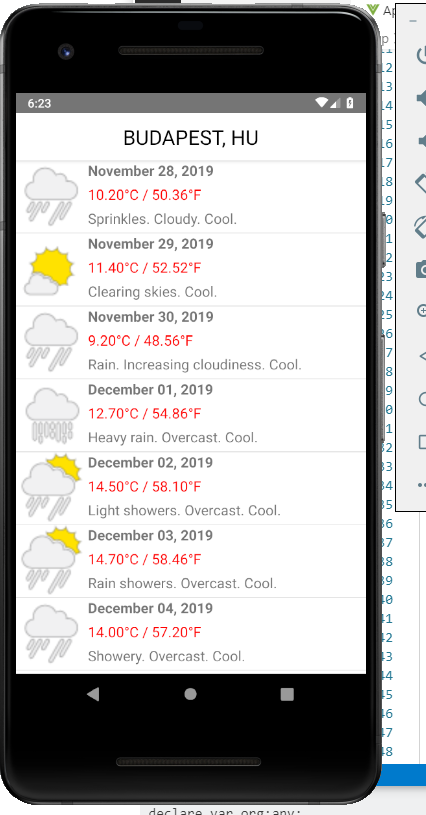
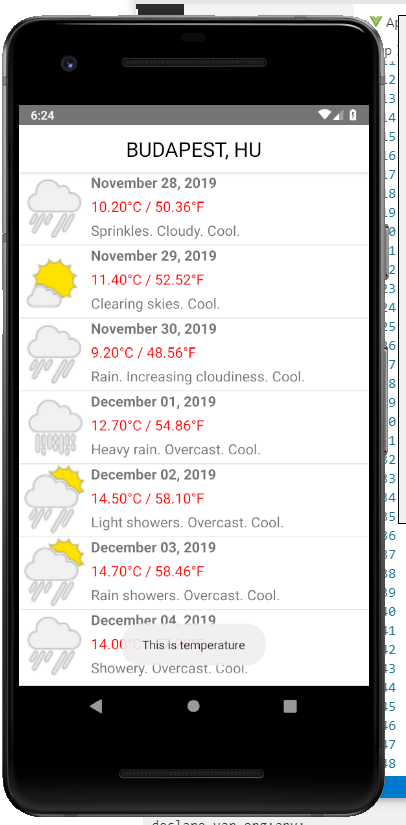

# ROBOT CONTROL NATIVESCRIPT VUE

## OVERVIEW

This is a basic application which call weather API from [here](https://here.com) and render to the UI. 

The program also call Java native API (Android Java Libary `RobotControlToastPlugin.jar`) to generate Toast.



## PLATFORM

Android

## CONCEPT

### **Connection with HTTP API**

```
http.getJSON("https://weather.api.here.com/weather/1.0/report.json" + this.encodeQueryParameters(params)).then(result =>{
            this.weather = result.dailyForecasts.forecastLocation.forecast;           
        }, error =>{
          console.error(error);
        })
```

### **Connection with JAVA API**

**1. Export Java libary**

```
package org.nativescript.robotcontrol.toaster;

import android.content.Context;
import android.widget.Toast;

public class Toaster {
    public void showToast(Context context, String text, String StrDuration) {
        int duration;
        switch (StrDuration) {
            case "short":
                duration = Toast.LENGTH_SHORT;
                break;
            case "long":
                duration = Toast.LENGTH_LONG;
                break;
        }
        Toast.makeText(context, text, Toast.LENGTH_SHORT).show();
    }
}
```
**2. Copy jar file into app -> App_Resouces -> Android -> libs**

**3. Run JAVA API**
```
 const context = application.android.context;
var toaster =new org.nativescript.robotcontrol.toaster.Toaster();
toaster.showToast(context,args.object.desc,"long");
```
- `org.nativescript.robotcontrol.toaster` is name of the package;
- `Toaster` is the name of the class;
- `showToast` is the name of the function;



### RUN APPLICATION

```
tns run android
```